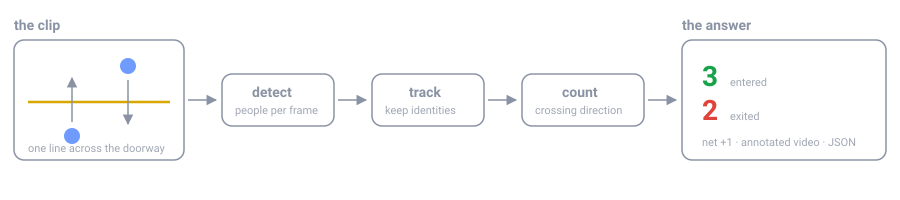

# People Counter

Count how many people **enter** and **exit** a shop or room in a video clip, from
the command line or a browser. Everything runs locally — clips are never
uploaded anywhere.



## How it works

```
video → detector → tracker → line counter → counts + annotated video
```

1. **Detect** — find every person in each frame (YOLOv8 by default).
2. **Track** — keep an identity for each person across frames, so one person is
   counted once rather than once per frame.
3. **Count** — when a tracked person's centre crosses your counting line, record
   the direction: crossing to the "inside" half counts as an entry, the other
   way as an exit.

The direction convention is the whole game: you draw one line across the
doorway and say which side is inside. Net occupancy is `entered − exited`.

## Install

```bash
cd people-counter
python3 -m venv .venv
.venv/bin/python -m pip install -r requirements.txt
```

Python 3.9+ works; 3.11 is what this was developed against. The first YOLO run
downloads `yolov8n.pt` (~6 MB) into `models/` and reuses it afterwards.

No ultralytics/torch on your machine? It still runs — the pipeline falls back to
a motion detector that needs no weights (see [Detectors](#detectors)).

## Web front-end

```bash
.venv/bin/python app.py
```

Open <http://127.0.0.1:5000> and:

1. **Upload a clip** — drag and drop, or click to choose.
2. **Place the counting line** — drag either endpoint across the doorway on the
   first frame. The green arrow shows which direction counts as *in*; hit
   **Flip direction** if it points the wrong way.
3. **Run** — a progress bar shows frames processed, live in/out counts and an ETA.
4. **Read the results** — totals, a timestamped list of crossings, the annotated
   video inline, and JSON/MP4 downloads.

Options: `--host`, `--port`, `--debug`. The upload cap defaults to 1024 MB (1 GB);
change it with `PC_MAX_UPLOAD_MB=2048`.

## Command line

```bash
.venv/bin/python count_video.py shop.mp4 -o annotated.mp4
```

Useful flags:

| Flag | What it does |
| --- | --- |
| `--line X1 Y1 X2 Y2` | Counting line in normalised (0–1) coordinates |
| `--line-y 0.6` | Shorthand for a horizontal line at 60% frame height |
| `--flip` | Swap which side counts as inside |
| `--detector auto\|yolo\|motion\|hog` | Choose the detector |
| `--confidence 0.4` | Detection threshold |
| `--stride 2` | Process every 2nd frame (roughly 2× faster) |
| `--min-hits 5` | Detections required before a person may be counted |
| `--max-age 45` | Frames a person keeps their identity while hidden |
| `--json out.json` | Write the full result, including every crossing |

Full list: `.venv/bin/python count_video.py --help`

## Detectors

| Name | Needs | Notes |
| --- | --- | --- |
| `yolo` | `ultralytics` + `torch` | Default and by far the most accurate. Works with a moving or fixed camera. |
| `motion` | nothing extra | MOG2 background subtraction. Fixed camera only, and anything person-sized that moves gets counted. |
| `hog` | OpenCV **4.x** | Classic pedestrian detector. OpenCV 5 removed it, so it raises a clear error there. |

`auto` picks `yolo` when ultralytics imports, otherwise `motion`.

Swap in a bigger model for better accuracy on crowded or low-light footage:

```bash
.venv/bin/python count_video.py shop.mp4 --model yolov8s.pt
```

## Getting good numbers

- **Put the line where people actually pass**, not at the very edge of frame —
  a track needs a few frames on each side to register a crossing.
- **Mount the camera high** and looking down the walking direction. Overhead or
  angled-down views separate people; a head-on view at eye level does not.
- **Raise `--min-hits`** if flickering detections near the threshold inflate the
  counts; **raise `--max-age`** if one person is being counted twice because
  they were briefly hidden.
- **Use `--stride`** for a fast first pass, then re-run at stride 1 for the real
  number. Fast walkers can slip across the line between sampled frames.
- Two people who walk through the door pressed together will be detected as one
  person by any single-camera counter, including this one.

## Try it without footage

```bash
.venv/bin/python tools/make_sample_video.py          # writes samples/sample_doorway.mp4
.venv/bin/python count_video.py samples/sample_doorway.mp4 --line-y 0.55 -o out.mp4
```

The sample is a synthetic doorway clip with a known ground truth (3 in, 2 out),
written alongside the video as `sample_doorway.truth.json`.

On this clip the `motion` detector scores 3/2 exactly and `yolo` scores 2/2 —
it misses the smallest, most distant figure. That ordering says nothing about
real footage: the walkers are drawn shapes, and YOLO was trained on photographs
of people. Use the sample to check the plumbing; judge accuracy on real video,
where YOLO wins comfortably.

## Tests

```bash
.venv/bin/python -m unittest discover -s tests -t . -v
```

46 tests covering the line geometry, the tracker, the counting rules, the video
pipeline and every HTTP endpoint. They inject scripted detections instead of
running a model, so they are fast and deterministic.

## Project layout

```
people_counter/
  config.py      CountingLine (normalised coords, half-plane test) and CountingConfig
  detectors.py   YOLO / motion / HOG backends, all returning Detection boxes
  tracker.py     greedy centroid+IoU tracker with short-term memory
  counter.py     line-crossing rules -> Counts and CrossingEvents
  annotate.py    overlay drawing for the output video
  pipeline.py    decode -> detect -> track -> count -> encode
app.py           Flask app and JSON API
jobs.py          background job manager for the web UI
count_video.py   command-line entry point
tools/           synthetic sample-clip generator
tests/           unit and HTTP tests
```

## HTTP API

| Method | Path | Purpose |
| --- | --- | --- |
| `POST` | `/api/upload` | Multipart upload; returns `video_id` and dimensions |
| `GET` | `/api/preview/<video_id>` | JPEG still for drawing the line on |
| `POST` | `/api/jobs` | Start a run; body carries `video_id`, `line` and settings |
| `GET` | `/api/jobs/<id>` | Status, progress, live counts, final result |
| `POST` | `/api/jobs/<id>/cancel` | Stop a running job |
| `GET` | `/api/jobs/<id>/video` | Annotated MP4 |
| `GET` | `/api/jobs/<id>/result.json` | Full result including every crossing |

## Limits

Jobs run one at a time in a single process, and state lives in memory — restart
the server and the job list is gone (the files in `outputs/` remain). It is a
local tool, not a multi-user service: don't expose it to the internet as-is.
